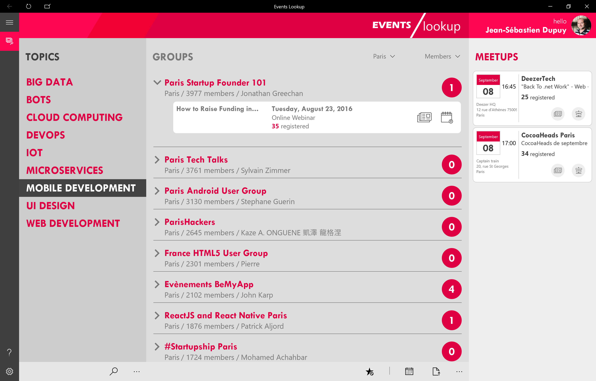
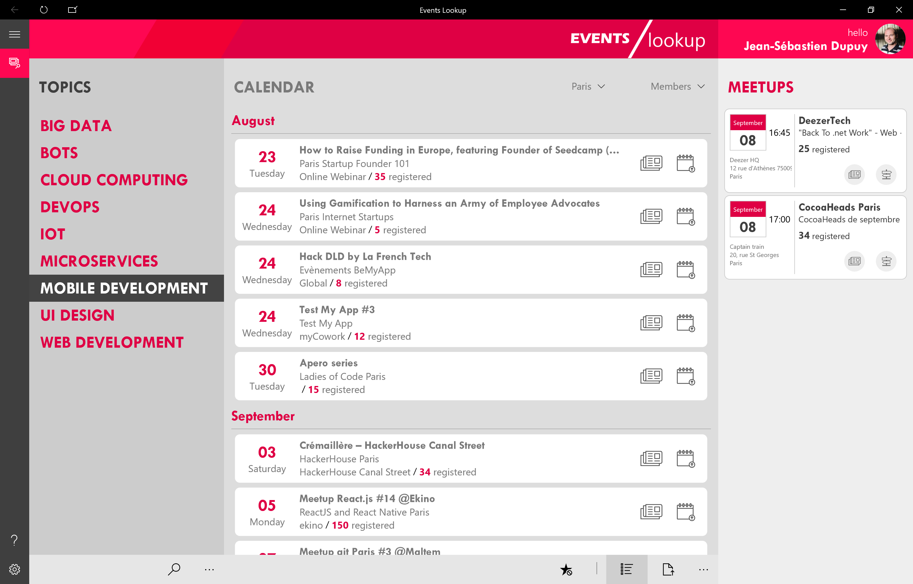

#Events Lookup

This application demonstrates usage of Meetup API with a Universal Windows Application. 
Don't hesite to contribute, report issue or request feature on GitHub.




### Getting Started

1. Sign-Up on http://www.meetup.com
2. Navigate to https://secure.meetup.com/fr-FR/meetup_api/oauth_consumers/ page.
3. Fill the Redirect Uri TextBox with your Package SID (for example 
ms-app://s-x-xx-x-xxxxxxxx-xxxxxxxxxx-xxxxxxxxxx-xxxxxxxxxx-xxxxxxxxxx-xxxxxxxxxx-xxxxxxxxxx/).
4. Paste Consumer Key, Secret Key and the Package SID into Keys.cs file.

```
    namespace EventsLookup.Helpers
    {
        /// <summary>
        /// A class that represents OAuth Keys
        /// </summary>
        public static class Keys
        {
            /// <summary>
            /// Gets Consumer Key
            /// </summary>
            public static string ConsumerKey => @"ConsumerKey";

            /// <summary>
            /// Gets Consumer Secret
            /// </summary>
            public static string ConsumerSecret => @"ConsumerSecret";

            /// <summary>
            /// Gets Windows Store Id (used for redirection)
            /// </summary>
            public static string WindowsStoreId => @"WindowsStoreId";
    }
}
```

Compile the code and run the application.